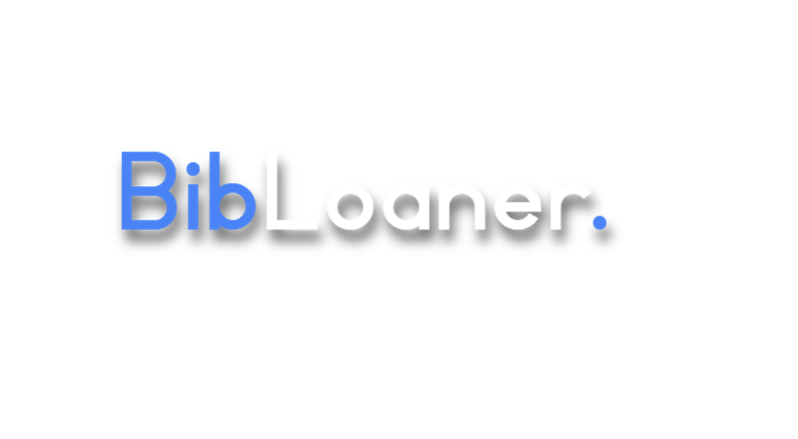

<p align="center">
  
</p>

# BibLoaner - A Python Program for Managing Library Loans

## Project Overview
BibLoaner is a Python program designed to facilitate library management tasks. Developed initially for a school project, it leverages Python Flask and MySQL to efficiently handle loaned books, member information, libraries, and more.

## Table of Contents
- [Project Overview](#project-overview)
- [Features](#features)
- [Requirements](#requirements)
- [Installation](#installation)
- [Getting Started](#getting-started)
- [Configuration](#configuration)
- [Usage](#usage)
- [Known Issues](#known-issues)

## Features
- **User-Friendly GUI**: Utilizes Python Flask to provide an intuitive graphical interface, simplifying library management tasks.

## Requirements
- Python 3.12.0 or higher
- Pip
- MySQL

## Installation
1. Clone the project repository using Git or download it manually.
2. Open a terminal window and navigate to the project directory.
3. Install the necessary dependencies by running the following command:
   ```bash
   pip install -r requirements.txt
   ```

## Getting Started
1. Navigate to the `settings.ini` file and configure any specific settings as required.
2. Ensure your MySQL server is running on port `3306` with the host set to `localhost`.
3. If not configured in the settings, use the default username `bibloaner` and password `dv1663`.
4. Start the BibLoaner application by running the following command:
   ```bash
   python bl.py
   ```
5. Open your web browser and navigate to `127.0.0.1:5000` to access the BibLoaner interface.

## Configuration
Modify settings in the `settings.ini` file to customize the BibLoaner application according to your specific requirements.

## Usage
Once the BibLoaner application is running, use the provided graphical interface to manage library loans, member information, and library resources efficiently.

## Known Issues
Currently, there are no known issues with the BibLoaner application.

Your contributions and feedback are appreciated. Thank you for using BibLoaner!
